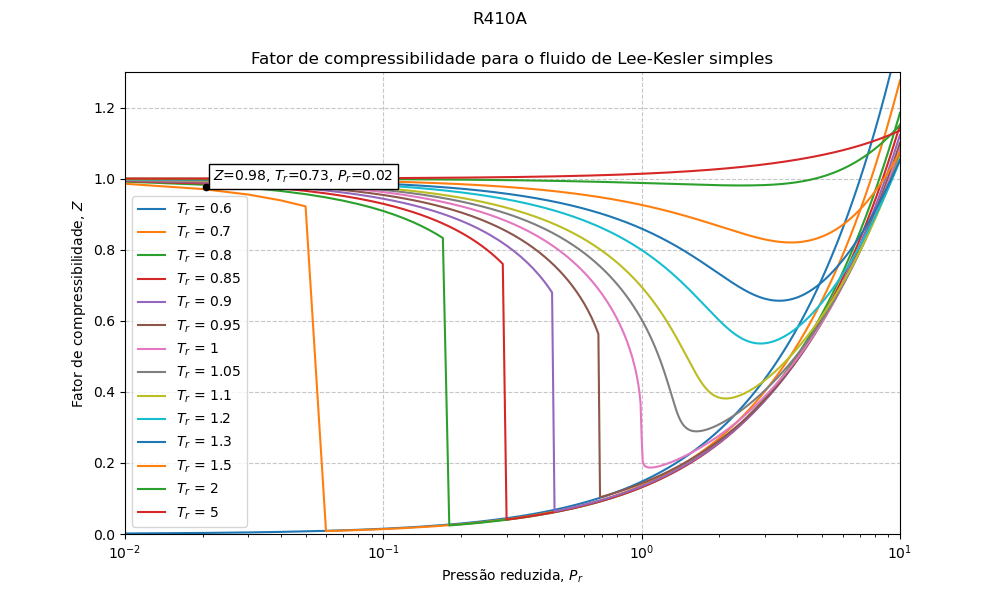

# Thermodynamic Analisys with Python
[](https://opensource.org/licenses/MIT)  [](https://doi.org/10.1021/je500939h)

This repository is dedicated to __undergraduates Engineering and Physics students__ who are studying the subjects of __Thermodynamics__ and __Fluid Mechanics__.

This project uses [CoolProp](http://www.coolprop.org/), an open-source thermophysical property library. For citation, please refer to:

Bell, I. H. _et al._ (2014). *CoolProp: An Open-Source Reference-Quality Thermophysical Property Library*. Journal of Chemical & Engineering Data, 59(10), 3324-3331. https://doi.org/10.1021/je500939h.

Read the [documentation](http://www.coolprop.org/) for more details.

## Features

- Calculate the compressibility factor of a pure substance from pressure, temperature and/or specific volume.

- Generate $Z$ vs. $P_r$ diagrams with mutilple $T_r$ curves.

- Automatically identify thermophysics properties of a pure substance from the pressure and temperature data.

<p align="center">
<h6 align="center">Compressibility factor for R410a</h6>

## Prerequisites

- Python 3.8+ version
- Libraries:
```pip install CoolProp matplotlib numpy```

